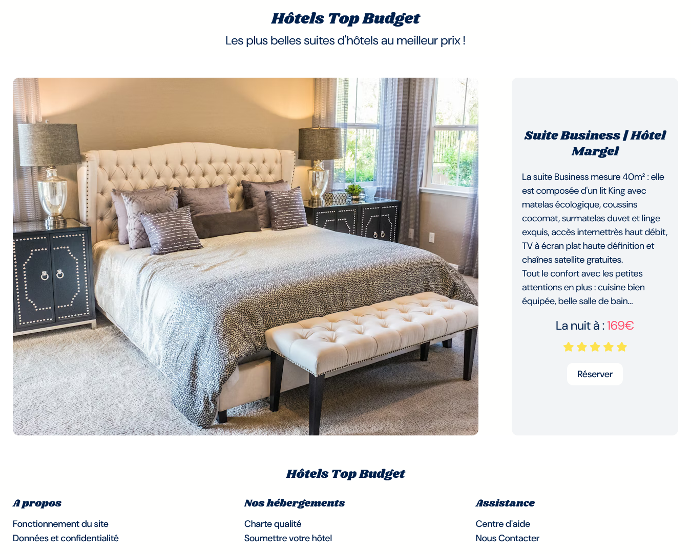
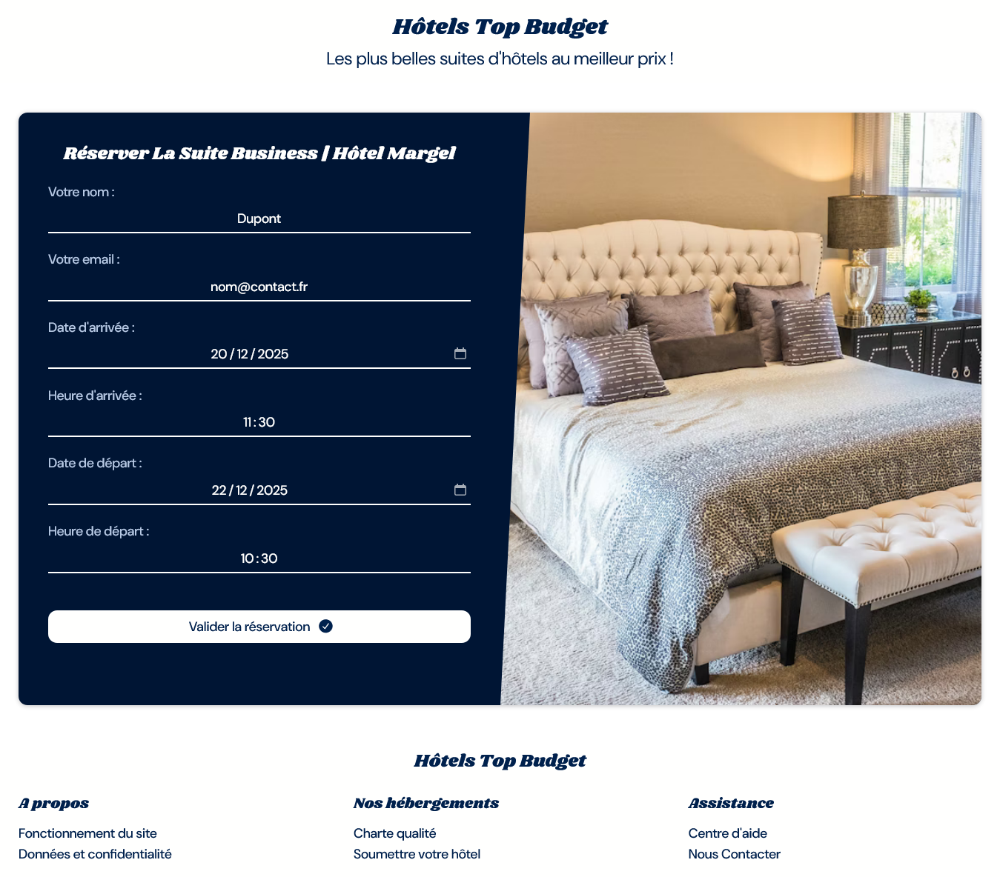

## RESERVATION SUITE D'HOTEL

- Page index.html :

- Page booking.html :

## Le challenge

Création d'une page de présentation d'une suite business et d'une page de réservation pour cette même suite d'hôtel en HTML5, CSS3 et JavaScript. Une modale informe de la validation de la réservation.

## Démonstration

Lien vers le projet : https://aperbet56.github.io/reservation_hotel/

## Projet développé avec

- Utilisation des balises sémantiques HTML5
- CSS3
- Flexbox
- Position absolute et position relative
- Pseudo-éléments
- Animations css (transition)
- Utilisation d'un normaliseur : le fichier normalize.css
- Importation des polices "Shrikhand" et "DM Sans"
- Desktop first
- Page web responsive
- Commentaires HTML
- Commentaires CSS
- JavaScript
- Code JavaScript commenté
- Regex
- Méthode test pour les regex
- Fenêtre modale
